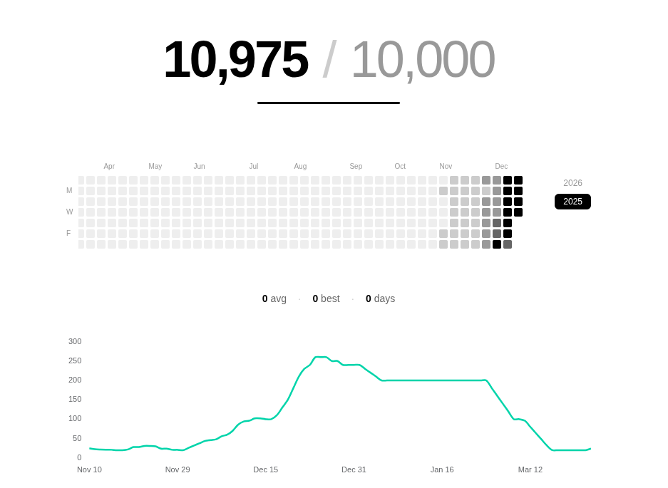

# A Flaw

This post is about a flaw in me that I am trying to understand and fix.

january (2026) - completed 10,000 pushups

## Context

Back in November 2025, I gave myself a challenge.

I started with just 3 pushups. Slowly, I worked my way up to 250 a day. I missed only one day during the entire journey.

On January 31st, I completed 10,000 pushups.

And then...

I never did another pushup again.

Not one.

### Flaw

That is the part that bothers me.

I have realized that I do not really chase goals. I chase proof.

The moment I prove to myself that I can do something, I lose all interest in it. My brain just checks it off and moves on, as if it never mattered.

The goal was never fitness.

Growing up, I was always told I was weak. People said I could not even do pushups. Maybe that stayed with me longer than I realized.

So those 10,000 pushups were never about becoming stronger.

They were just me trying to prove that I could.

Now I keep wondering how many things in my life I have done for the same reason.

I am trying to fix this part of myself.

I want to learn how to keep doing something because I genuinely enjoy it or because it makes my life better, not just because I needed to prove a point once.

It is a flaw I am still trying to understand.
